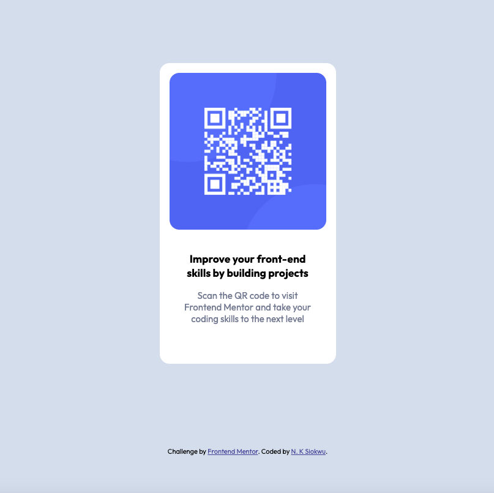

# Frontend Mentor - QR Code Component Solution

This is my solution to the [QR code component challenge on Frontend Mentor](https://www.frontendmentor.io/challenges/qr-code-component-iux_sIO_H). Frontend Mentor challenges help you improve your coding skills by building realistic projects. 

## Table of contents

- [Overview](#overview)
  - [Screenshot](#screenshot)
  - [Links](#links)
- [My process](#my-process)
  - [Built with](#built-with)
  - [What I learned](#what-i-learned)
- [Author](#author)
- [Acknowledgments](#acknowledgments)


### Screenshot




### Links

- Solution URL: [Add solution URL here](https://your-solution-url.com)
- Live Site URL: [Add live site URL here](https://your-live-site-url.com)

## My process
I began by constructing a semantic HTML structure, creating classes to style the page, and then applying those styles.

### Built with

- Semantic HTML5 markup
- CSS
- Flexbox
- Mobile-first workflow


### What I learned

I learnt how to center a div both horizontally and vertically. At first, I was able to center the div horizontally by using: 

```css
.card {
  margin-left: auto;
  margin-right:auto; 
}
```
I realized the div wasn't centered horizontally so I then applied a display flex layout to the parent div and used the `justify-content` and `align-items` properties. This centered the div but the window had a scrollbar which meant a user will have to scroll to see the entire page. Adding: `min-height: 90vh` and `max-height: 90vh` to the parent div gave me the look i was after.


## Author

- Github - [N. K. Siokwu](https://github.com/ladykays)
- Frontend Mentor - [@ladykays](https://www.frontendmentor.io/profile/ladykays)

## Acknowledgments
I am immensely grateful to Dr. Angela Yu for introducing me to the Frontend Mentor challenge, as well as frontendmentor.io for providing this amazing opportunity. I can't wait to tackle more of these challenges!
